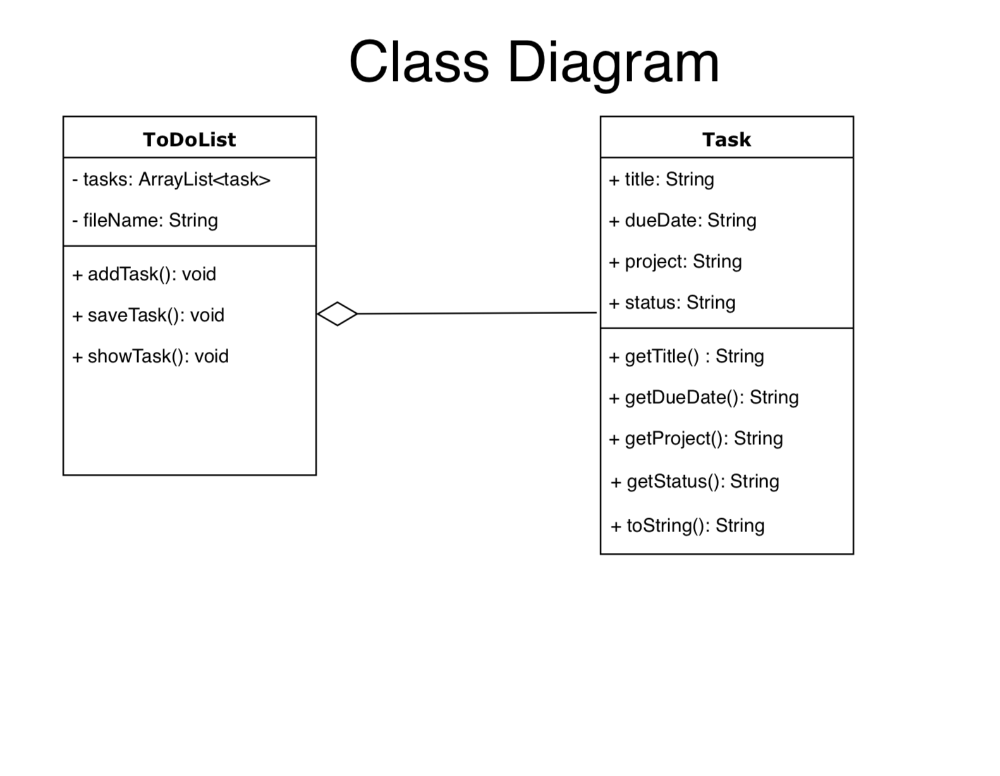
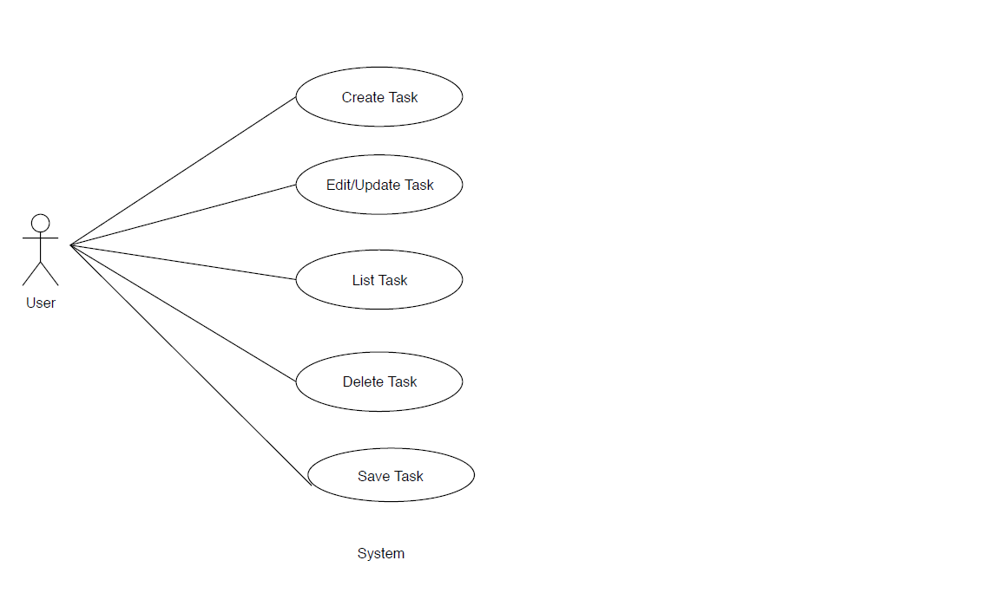

<!-- Headings -->
# &nbsp; &nbsp; &nbsp; &nbsp; &nbsp; &nbsp; &nbsp; &nbsp; &nbsp; &nbsp; &nbsp; &nbsp; &nbsp; To do list Specification

<!-- Tables -->
|   |   |
| ---- | ---|
| Author | Megha Thakare|
| Company | Novare Software Development Academy|
| Created | 10-10-2019|

## 1.&nbsp; Project Description
### 1.1 &nbsp; Requirements         
&nbsp; &nbsp; &nbsp; &nbsp; The project is about create a to do list application to simplify user’s task management which can help them to list down the tasks, to get organized and get things done.This application allows users to use a text-based user interface via the command-line. With this application the user should be able to create new tasks and assign them a title, due date, project and status. The user should also be able to edit the task, mark the status as done or remove tasks. They can also view all the tasks or can view the collection of tasks sorted by date or project. They can also quit and save the current task list to file, and then restart the application with the former state restored. 

### 1.2 &nbsp;  User Interface
&nbsp; &nbsp; &nbsp; &nbsp; The user interface should be similar as shown below:

&nbsp; &nbsp; &nbsp; &nbsp; &gt;&gt; Welcome to ToDoList

&nbsp; &nbsp; &nbsp; &nbsp; &gt;&gt; You have X tasks todo and Y tasks are done!

&nbsp; &nbsp; &nbsp; &nbsp; &gt;&gt; Pick an option:

&nbsp; &nbsp; &nbsp; &nbsp; &gt;&gt; (1) Show Task List (by date or project)

&nbsp; &nbsp; &nbsp; &nbsp; &gt;&gt; (2) Add New Task

&nbsp; &nbsp; &nbsp; &nbsp; &gt;&gt; (3) Remove Task

&nbsp; &nbsp; &nbsp; &nbsp; &gt;&gt; (3) Edit Task (update, mark as done)

&nbsp; &nbsp; &nbsp; &nbsp; &gt;&gt; (4) Save and Quit

&nbsp; &nbsp; &nbsp; &nbsp; &gt;&gt;

## 2.&nbsp; Class Diagram
## 3.&nbsp; Use Case Diagram
